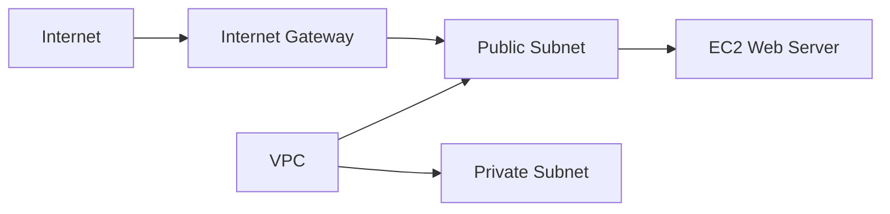

# Project 3 — AWS VPC Network

## Objective
To understand how to build a basic network infrastructure in AWS using Amazon VPC.

## AWS Services Used
- Amazon VPC
- Subnets
- Internet Gateway
- Route Tables
- Security Groups

## What I Built
I created a VPC with public and private subnets, configured an Internet Gateway, created route tables, and configured network access.

## Skills Demonstrated
- VPC creation
- Subnet configuration
- Internet Gateway
- Route table configuration
- Network security

## Result
A basic AWS cloud network was successfully created and configured.

## Architecture

## Screenshots
Screenshots in this folder demonstrate the VPC, subnets, Internet Gateway, route tables, and security configuration.
