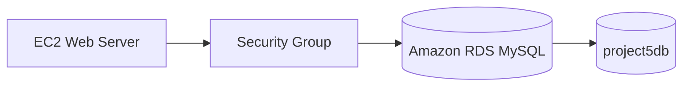

# Project 5 — Amazon RDS MySQL Database

## Objective
To learn how to create and connect to a managed relational database using Amazon RDS.

## AWS Services Used
- Amazon RDS
- MySQL
- Amazon VPC
- Security Groups

## What I Built
I created a MySQL database using Amazon RDS, configured networking and security, connected to the database, created a table, and inserted user data.

## Skills Demonstrated
- RDS database creation
- MySQL
- Database connectivity
- VPC networking
- Security group configuration
- SQL basics

## Result
The MySQL database was successfully created and accessed from the cloud environment.

## Architecture

## Database Flow
EC2 → RDS MySQL

## Screenshots
Screenshots in this folder demonstrate the RDS database, networking configuration, and successful database queries.
