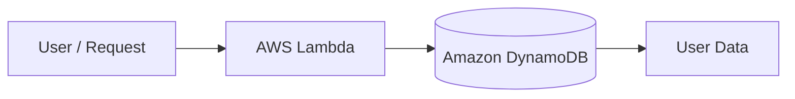

# Project 8 — Serverless NoSQL Application

## Objective
To learn how to use Amazon DynamoDB with AWS Lambda to build a serverless data application.

## AWS Services Used
- Amazon DynamoDB
- AWS Lambda
- IAM

## What I Built
I created a DynamoDB table, added user data, and created a Lambda function that retrieves the data from DynamoDB.

## Skills Demonstrated
- NoSQL databases
- DynamoDB tables
- Lambda
- IAM permissions
- Serverless architecture
- AWS SDK for Python (Boto3)

## Architecture

## Result
The Lambda function successfully retrieved the user information stored in DynamoDB.

## Screenshots
Screenshots in this folder demonstrate the DynamoDB table, item, Lambda code, permissions, and successful Lambda test.
