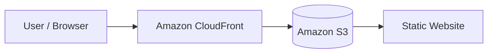

# Project 9 — Global Website Delivery with CloudFront and S3

## Objective
To learn how to deliver an S3-hosted website globally using Amazon CloudFront.

## AWS Services Used
- Amazon S3
- Amazon CloudFront
- Origin Access Control (OAC)

## What I Built
I configured an S3 bucket as the origin for a CloudFront distribution and configured secure access between CloudFront and S3.

## Skills Demonstrated
- Content Delivery Networks (CDN)
- CloudFront
- S3
- Origin Access Control
- HTTPS
- Global content delivery

## Architecture

## Result
The website was configured for global delivery through Amazon CloudFront.

## Screenshots
Screenshots in this folder demonstrate the CloudFront distribution, S3 origin, security configuration, and website delivery.
