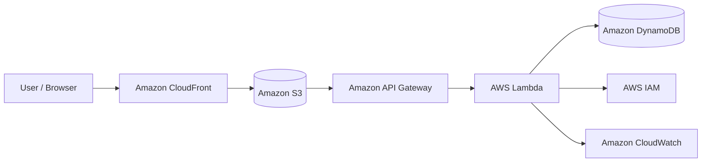

# Project 10 — Complete AWS Serverless Web Application

## Objective
To build a complete serverless web application by combining multiple AWS services.

## AWS Services Used
- Amazon S3
- Amazon CloudFront
- Amazon API Gateway
- AWS Lambda
- Amazon DynamoDB
- AWS IAM
- Amazon CloudWatch

## What I Built
I created a serverless web application where a frontend hosted on S3 and delivered through CloudFront communicates with an API Gateway endpoint. API Gateway invokes Lambda, which retrieves user data from DynamoDB.

## Architecture

## Skills Demonstrated
- Serverless architecture
- S3 static website hosting
- CloudFront
- API Gateway
- Lambda
- DynamoDB
- IAM
- CloudWatch
- API integration
- CORS configuration

## Result
The complete serverless web application was successfully deployed and tested. The website retrieves user information from DynamoDB through the API.

## Screenshots
Screenshots in this folder demonstrate the AWS services, configurations, API response, working website, and CloudWatch logs.
